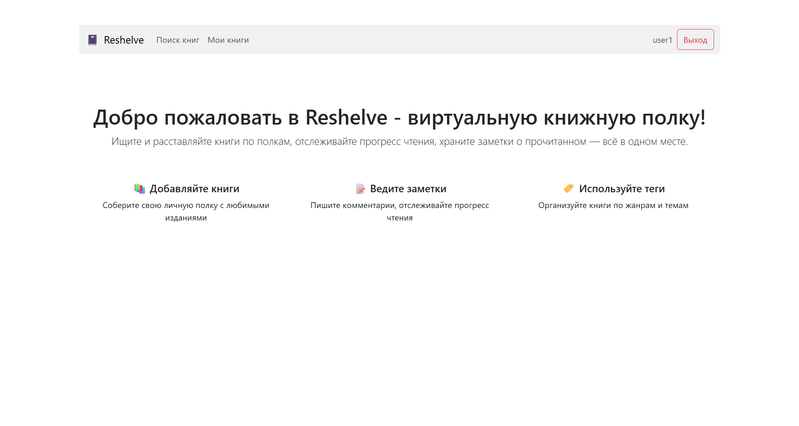
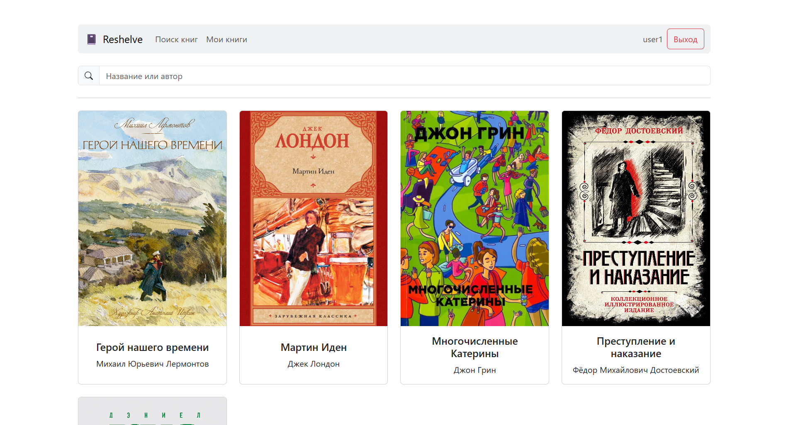
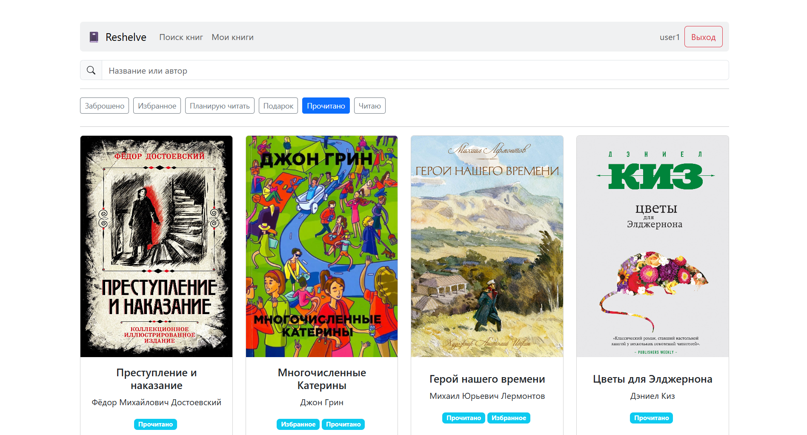
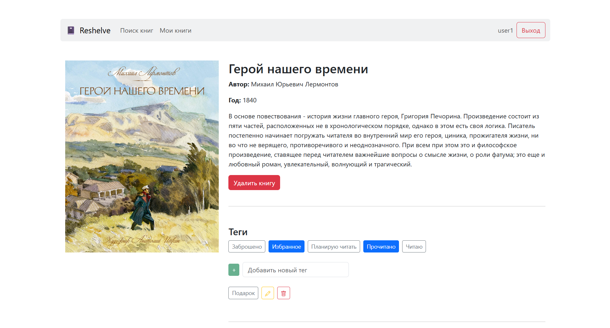

# 📚 Reshelve - client
Клиентска часть приложения для создания виртуальной книжной полки пользователей. Написана на React с использованием Bootstrap.

Приложение может работать как локально, так и на хостинге Vercel. 

> [!NOTE]  
> Backend-часть приложения лежит в репозитории [reshelve-server](https://github.com/icnsat/reshelve-server).  

### Установка и запуск

Для установки зависимостей выполнить команду:

```sh
npm i
```

Для запуска приложения выполнить команду:

```sh
npm start
```

В приложении находится .env файл с конфигурацией URL адреса для api приложения. Если файла нет или URL не задан, по умолчанию используется адрес `http://localhost:5000`. Пример `.env` файла: 

```.env
REACT_APP_API_BASE_URL=http://localhost:5000
```

### Изображения: 
|  |  |
|-|-|
|  |  |
